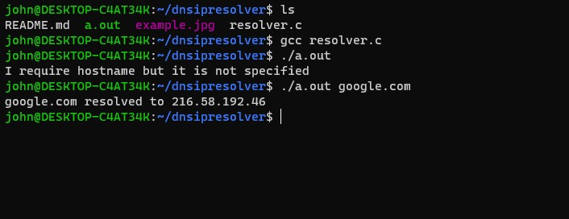
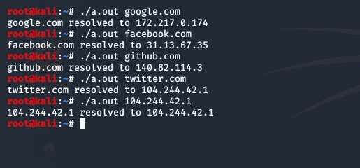

# Dns IP Resolver
```
What Is a IP Resolver?
A IP resolver communicates with your router by sending a dns query.
The router then replies with the ip address of the website.
Then the dns resolver displays the ip
```
# Usage
```
How to compile?
Open a terminal
Type: gcc resolver.c && ./a.out google.com
```
Check the examples below<br>
** Example 1**<br>

** Example 2**<br>

